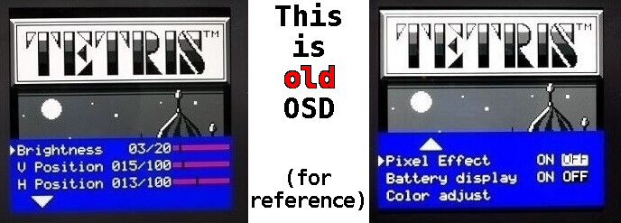
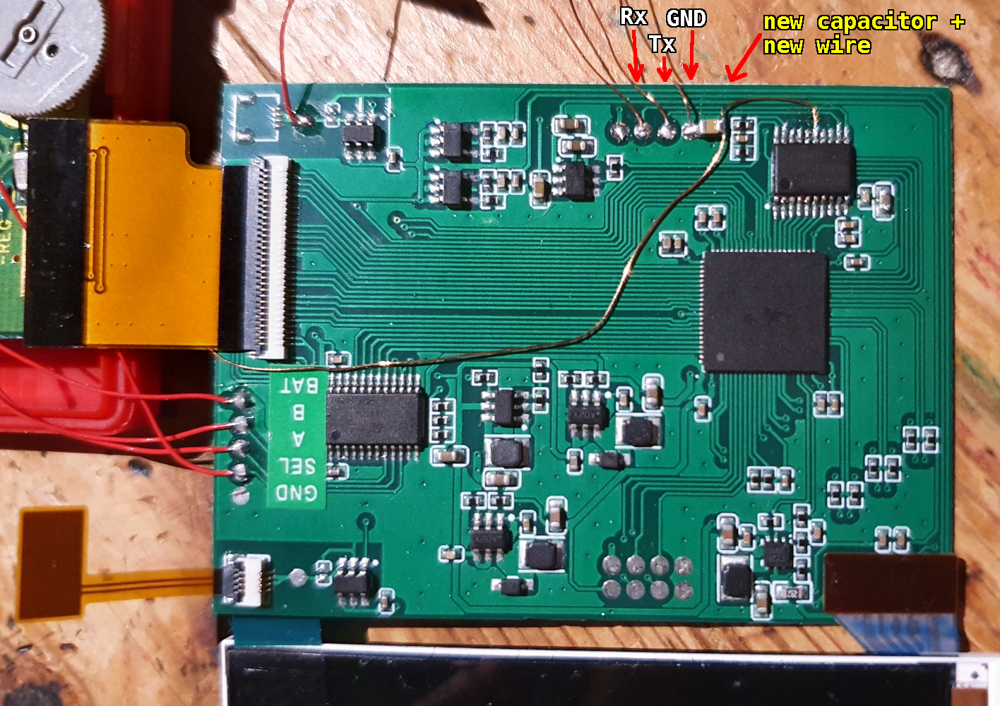
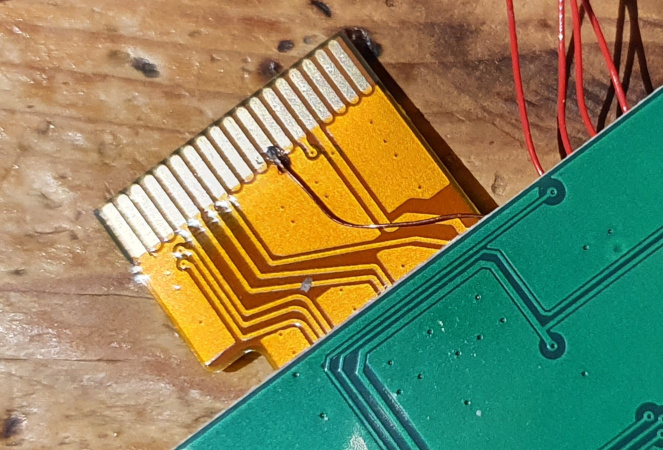

# IPS kit OSD replacement

This is open source alternative of STC8G1K17 MCU which controls OSD in this **specific** IPS LCD kit for **gameboy pocket**.

## Warning

Pinout, SPI commands and stuff is based on **reverse engineering** of this specific IPS LCD kit!

If you decide to use this firmware i assume you are willing to take **risk of bricking** your IPS LCD kit!

**Currently, there is no way to return to the original firmware!**

**Pay close attention to the PCB board photo i provided!**

## Options

This firmware provides multiple compile-time options. These can be changed in `defs.h`.

## Requirements

- Python 3
  - with `pillow` library
- Make
- SDCC
- [stcgal](https://github.com/grigorig/stcgal/) (flashing tool)

## How to compile

- install requirements
- enter project directory
- use `make` command

## How to flash

`stcgal.py -o program_eeprom_split=16384 flash.ihx`

It is important to set `program_eeprom_split`!

Connect `Tx -> Rx` and `Rx -> Tx`. Use only 3V3 UART adapter!

## How to enter the menu

Touch both touch inputs at the same time.

### How to leave the menu

Go to main menu and touch both touch inputs at the same time.

## Input mapping

Technically, it should be possible to rewire three available inputs (A, B and select) to different keys.

## Icons

Graphics, including every text, is in `images` directory. These PNG files automaticaly are converted when building using make.

Icons and texts can use 4 "shades". Palette is hardcoded due to OSD limitations.

## Fake boot logo

If enabled, OSD is used to scroll a custom logo on power-on.

Beware, `logo.png` should only use two colors!

## Use Brightness pot

You can use original `contrast` pot to control `brightness` but it **requires** extra **hardware modification**.

If you don't have this modification make sure to disable `ADC_BACKLIGHT` compile option!

This modification is single wire and single capacitor, about 1uF.

## Images

